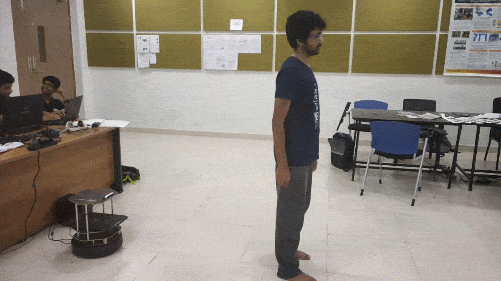

# Person Following Robot

This repository aims to make an algoirthm to follow a person autonomously. This algorithm has been successfully tested on a TurtleBot2. Hand gesture for stopping/starting has also added for easier target acquisition. Attempts have been made to reduce the effect of occlusion.
<br>If you are using this repository please cite this paper: [paper](https://link.springer.com/chapter/10.1007/978-981-15-3639-7_98) and Star our repo.

## Table of contents
- [Person Following Robot](#person-following-robot)
  - [Table of contents](#table-of-contents)
  - [Working Demo](#working-demo)
  - [Results](#results)
  - [Abstract](#abstract)
  - [Instructions](#instructions)
        - [Host Machine (machine running roscore)](#host-machine-machine-running-roscore)
        - [Remote Machine](#remote-machine)
        - [Run the code](#run-the-code)
  - [Dependencies](#dependencies)
  - [Citations](#citations)
  - [Contributors](#contributors)

## Working Demo
[YouTube Link](https://youtu.be/XnrbU1050ls)

## Results


## Abstract
Helper robots are widely used in various situations, for ex-ample at airports and railway stations. This paper presents a pipeline to multiplex the tracking and detection of a person in dynamic environments using a stereo camera in real-time. Recent developments in object detection using ConvNets have led to robust person detection. These deep convolutional neural networks generally fail to run with high frames rates on devices with less computing power. Trackers are also used to retain the identity of the target person as well as impose fewer constraints on hardware. A concept of multiplexed detection and tracking is used which makes the pipeline faster by many folds. TurtleBot2 is used for prototyping the robot and tuning of the motion controller. Robot Operating System (ROS) is used to set up communication be-tween various nodes of the pipeline. The results found were comparable to current state-of-the-art person followers and can be readily used in day to day life.

## Instructions

Setting up remote server for faster processing:

##### Host Machine (machine running roscore)
- ```export ROS_MASTER_URI=http://192.168.0.113:11311``` (replace with host machine ip)
- ```export ROS_IP=192.168.0.123 ```(replace with host machine ip)
- ```export ROS_HOSTNAME=192.168.0.123 ``` (replace with host machine ip)

##### Remote Machine
- ```export ROS_MASTER_URI=http://192.168.0.113:11311 ```(replace with host machine ip)
- ```export ROS_IP=192.168.0.123``` (replace with local machine ip)
- ```export ROS_HOSTNAME=192.168.0.123``` (replace with host machine ip)

##### Run the code
- Run the `follow.py` code to see the output

## Dependencies
- Anaconda: [link](https://docs.anaconda.com/anaconda/install/linux/) (*OPTIONAL*)
- OpenCV: [link](https://docs.opencv.org/trunk/d7/d9f/tutorial_linux_install.html)
- PyTorch: [link](https://pytorch.org/)
- pyrealsense2: [link](https://pypi.org/project/pyrealsense2/)

## Citations

If you find our research useful please cite our paper at

```
@InProceedings{10.1007/978-981-15-3639-7_98,
author="Agrawal, Khush
and Lal, Rohit",
editor="Kalamkar, Vilas R.
and Monkova, Katarina",
title="Person Following Mobile Robot Using Multiplexed Detection and Tracking",
booktitle="Advances in Mechanical Engineering",
year="2021",
publisher="Springer Singapore",
address="Singapore",
pages="815--822",
isbn="978-981-15-3639-7"
}
```

## Contributors
- **Khush Agrawal** - [Website](https://khush3.github.io/)
- **Rohit Lal** - [Website](http://take2rohit.github.io/)


